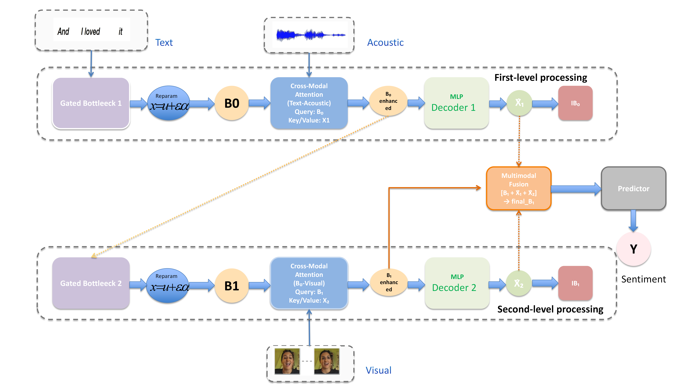

# GICA: Gate-Controlled Information Bottleneck Cross-Modal Attention Network

A multimodal sentiment analysis model based on information bottleneck theory.

---

## Overview

GICA employs the gated information bottleneck method with cross-modal attention to form compact and informative latent states. It introduces a hierarchical two-layer gated information bottleneck to progressively compress and refine multimodal representations (text, acoustic, visual), combined with cross-modal attention to capture inter-modal dependencies.

**Key features:**
- Two-layer gated bottleneck architecture with learnable IB loss weights
- Cross-modal attention between text↔acoustic (Layer 1) and bottleneck↔visual (Layer 2)
- Adaptive weight decay for information bottleneck regularization
- Comprehensive ablation study support for both fusion modes and gating mechanisms
- Built on `microsoft/deberta-v3-base` as the text encoder backbone



---

## Requirements

- Python 3.8+
- PyTorch 1.12+
- transformers 4.29.2

Install all dependencies:

```bash
pip install -r requirements.txt
```

| Package | Version |
|---|---|
| transformers | 4.29.2 |
| torch | ≥ 1.12 |
| numpy | 1.22.4 |
| scikit-learn | 1.2.2 |
| scipy | 1.10.1 |
| sentencepiece | 0.1.99 |
| tqdm | 4.65.0 |

---

## Project Structure

<pre>
├── GICA.py                  # Core GICA model (bottleneck, attention, fusion)
├── deberta_GICA.py          # DeBERTa integration wrapper
├── train.py                 # Training, evaluation, and ablation scripts
├── global_configs.py        # Dataset-specific dimension configs
├── requirements.txt         # Python dependencies
├── datasets/                # Place CMU-MOSI / CMU-MOSEI .pkl files here
└── saved_models/            # Saved checkpoints (created at runtime)
</pre>

---

## Quick Start

**1. Clone the repository and install dependencies:**

```bash
git clone https://github.com/yuhaoqiang62-star/GICA.git
cd GICA
pip install -r requirements.txt
```

**2. Download the datasets** to `./datasets`. For details, see [here](https://github.com/WasifurRahman/BERT_multimodal_transformer).

**3. Train the model:**

```bash
python train.py --dataset mosi
python train.py --dataset mosei
```

---

## Training Options

### Save & Load Models

```bash
# Save checkpoints during training
python train.py --dataset mosi --save_model --model_save_dir saved_models/

# Load a saved checkpoint
python train.py --load_model saved_models/best_model_mosi_full_dual_gating.pt
```

### Ablation Studies

```bash
# Fusion mode ablation (b1_only / b1_acoustic / b1_visual)
python train.py --dataset mosi --fusion_mode b1_only
python train.py --dataset mosi --fusion_mode b1_acoustic
python train.py --dataset mosi --fusion_mode b1_visual


# Gating mechanism ablation (no_gating / single_gating )
python train.py --dataset mosi --gating_mode no_gating
python train.py --dataset mosi --gating_mode single_gating


### Key Arguments

| Argument | Default | Description |
|---|---|---|
| `--dataset` | `mosi` | Dataset: `mosi` or `mosei` |
| `--n_epochs` | 18 / 3 | Training epochs (mosi / mosei) |
| `--train_batch_size` | 8 | Training batch size |
| `--learning_rate` | 1e-5 | AdamW learning rate |
| `--max_seq_length` | 50 | Maximum token sequence length |
| `--B0_dim` | 128 | Dimension of first bottleneck |
| `--B1_dim` | 64 | Dimension of second bottleneck |
| `--fusion_mode` | `full` | `b1_only` / `b1_acoustic` / `b1_visual` / `full` |
| `--gating_mode` | `dual_gating` | `no_gating` / `single_gating` / `dual_gating` |
| `--seed` | 128 | Random seed |
| `--save_model` | `False` | Whether to save checkpoints |

---

## Evaluation Metrics

| Metric | Description |
|---|---|
| Acc-2 | Binary sentiment accuracy (positive / negative) |
| MAE | Mean Absolute Error (lower is better) |
| Corr | Pearson correlation coefficient |
| F1 | Weighted F1 score |
| BA | Binary accuracy based on zero threshold |

---


## Acknowledgements

This work builds on [microsoft/deberta-v3-base](https://huggingface.co/microsoft/deberta-v3-base) and the CMU Multimodal SDK. We thank the authors of MulT, BERT-MAG, and related works for their open-source contributions.
